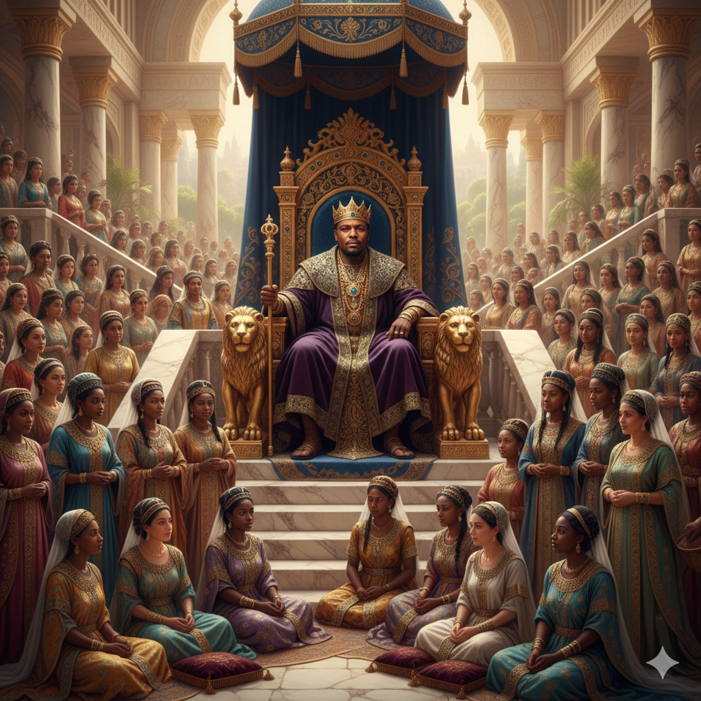
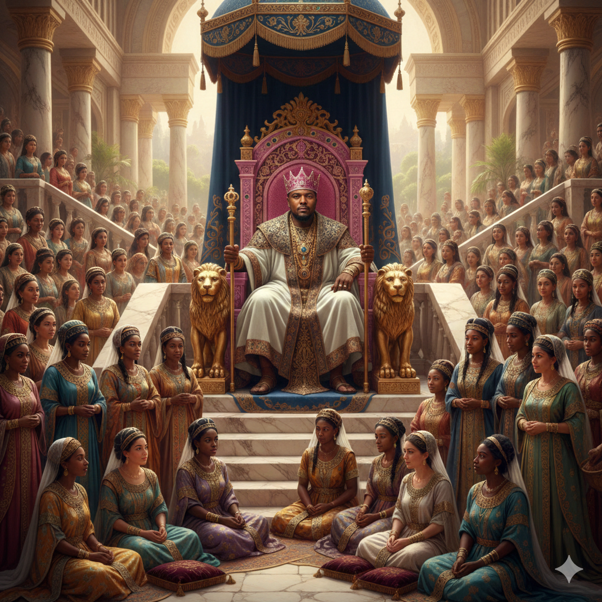

# Image Generation Prompt Design

## Model

Nano Banana

## Prompt

A realistic image of me reimagined as King Solomon, 700 wives, 300 concubine visible somehow.

### Output

## Refined prompt

A realistic image of me reimagined as King Solomon, 700 wives, 300 concubine visible somehow. The king should wear a white robe, two golden spectre (one on the left, one on the right). A pink crown and pink throne.

### Output

## Comparison

The vague prompt was a bit generic and the AI was able to make varying creative choice. But with a refined prompt, the AI's creativity is a bit refined to the choice of the prompter (me).
